# Lab - Create, deploy and test a new API using the API Connect Developer Toolkit

In this lab you will create a new API using the OpenAPI definition of an existing RESTful web-service that  gets realtime stock quotes. You will then test the deployed API by deploying the *IBM Trader Lite* application which is a simple stock trading sample, written as a set of microservices. The app uses the API definition that you will create to get realtime stock quotes.

The architecture of the  app is shown below:

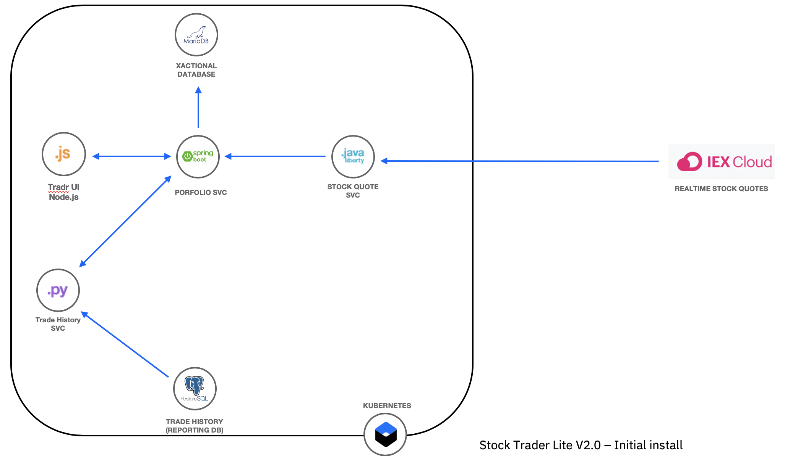

* **Tradr** is a Node.js UI for the portfolio service

* The **portfolio** microservice sits at the center of the application. This microservice:
   * persists trade data  using JDBC to a MariaDB database
   * invokes the **stock-quote** service that invokes an API defined in API Connect in CP4I to get stock quotes
   * calls the **trade-history** service to store trade data in a PostgreSQL database that can be queried for reporting purposes.
   * calls the **trade-history** service to get aggregated historical trade data.


This lab is broken up into the following steps:

1. [Download the OpenAPI definition file for the external Stock Quote service](#step-1-download-the-openapi-definition-file-for-the-external-stock-quote-service)

1. [Import the OpenAPI definition file into API Manager](#step-2-import-the-openapi-definition-file-into-api-manager)

1. [Configure the API](#step-3-configure-the-api)

1. [Test the API](#step-4-test-the-api)

1. [Create a new OpenShift project for the Trader Lite app](#step-5-create-a-new-openshift-project-for-the-trader-lite-application)

1. [Prepare for Installation](#step-6-prepare-for-installation)

1. [Install the Trader Lite app](#step-7-install-the-trader-lite-app)

1. [Verify that the Trader Lite app is calling your API successfully](#step-8-verify-that-the-trader-lite-app-is-calling-your-api-successfully)

1. [Summary](#summary)

## Step 1: Download the OpenAPI definition file for the external Stock Quote service

1.1 In your browser right click on  the following link, right click and select **Save Link As ...** from the context menu. Save the file *stock-quote-api.yaml* to  your local system.

   [stock-quote-api.yaml](https://raw.githubusercontent.com/IBMStockTraderLite/stocktrader-cp4I/master/apic/stock-quote-api.yaml)


## Step 2: Import the OpenAPI definition file into API Manager

2.1 Go to the browser tab with the API Manager Portal and click on the **Develop APIs and Products tile**

   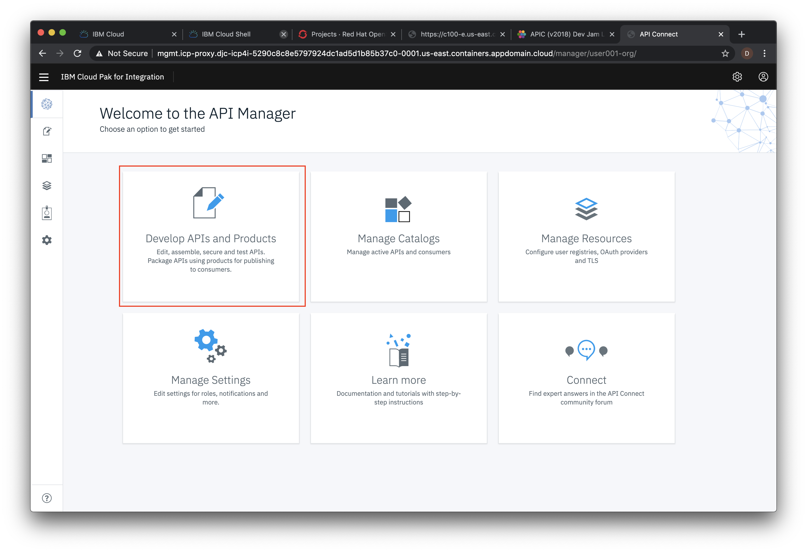

2.2 Click **ADD->API**

  

2.3 On the next screen select **Existing OpenAPI** under **Import** and then click **Next**.

  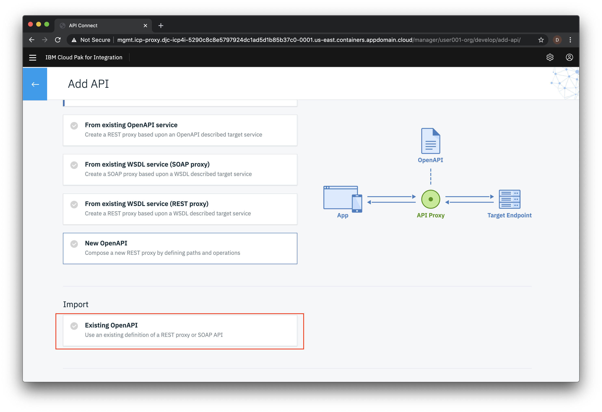

2.4 Now choose **stock-quote-api.yaml** fromyour local file system and click **Next**.

  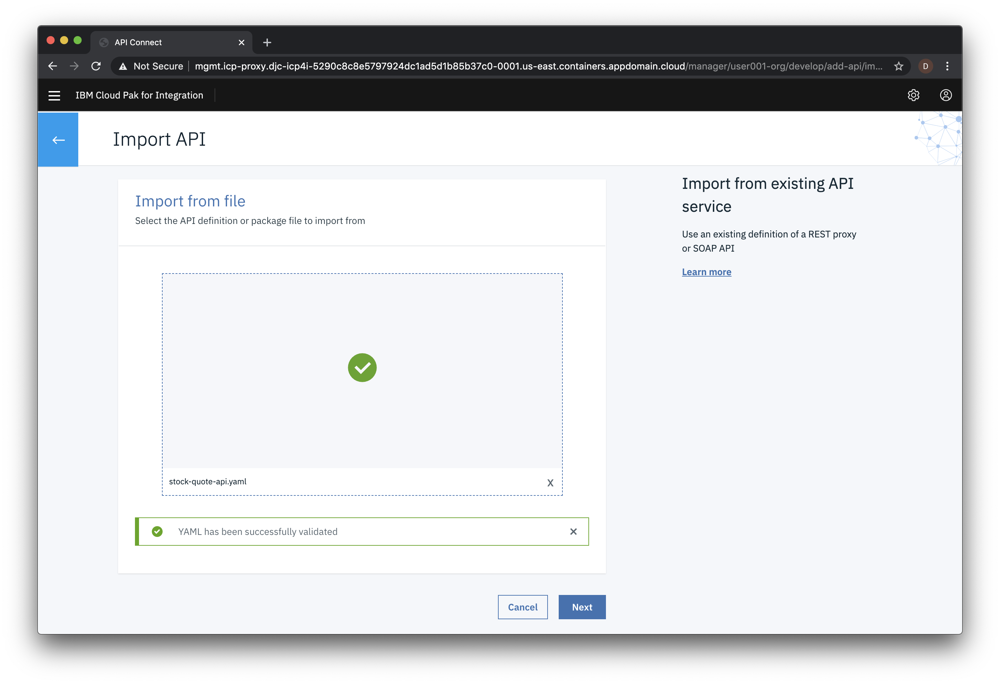

2.5 **Do not** select **Activate API**. Click **Next**

  

2.6 The API should be imported successfully as shown below. Click **Edit API**.

  

## Step 3: Configure the API

After importing the existing API, the first step is to configure basic security before exposing it to other developers. By creating a client key  you are able to identify the app using the services. Next, we will define the backend endpoints where the API is actually running. API Connect supports pointing to multiple backend endpoints to match your multiple build stage environments.

3.1 In the Edit API screen click **Security Definitions**

3.2 In the **Security Definition** section, click the **Add** button on the right. This will open a new view titled **API Security Definition**.

3.2 In the **Name** field, type `client-id`.

3.3 Under **Type**, choose **API Key**. This will reveal additional settings.

3.4 For **Located In** choose **Header**. For **Key Type** choose **Client ID**. Your screen should look like the image below.

  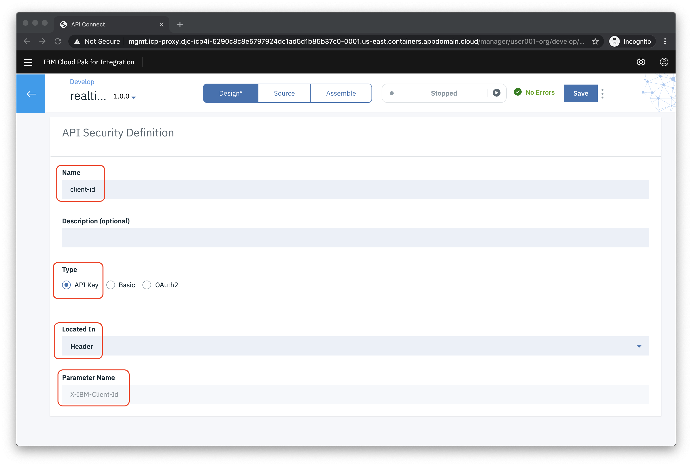   

3.5 Click the **Save** button to return to the **Security Definitions** section.

3.6 Click **Security** in the left menu. Click **Add**. Select the **client-id** as shown below and then click **Save**.

  

3.7 Next you'll the define the endpoint for the external API. Click on **Properties** in the left menu.

3.8 Click on the **target-url** property. Click **Add**.

3.9 Choose the **sandbox** catalog and for the URL copy and paste the following URL:

    https://stock-trader-quote.us-south.cf.appdomain.cloud

   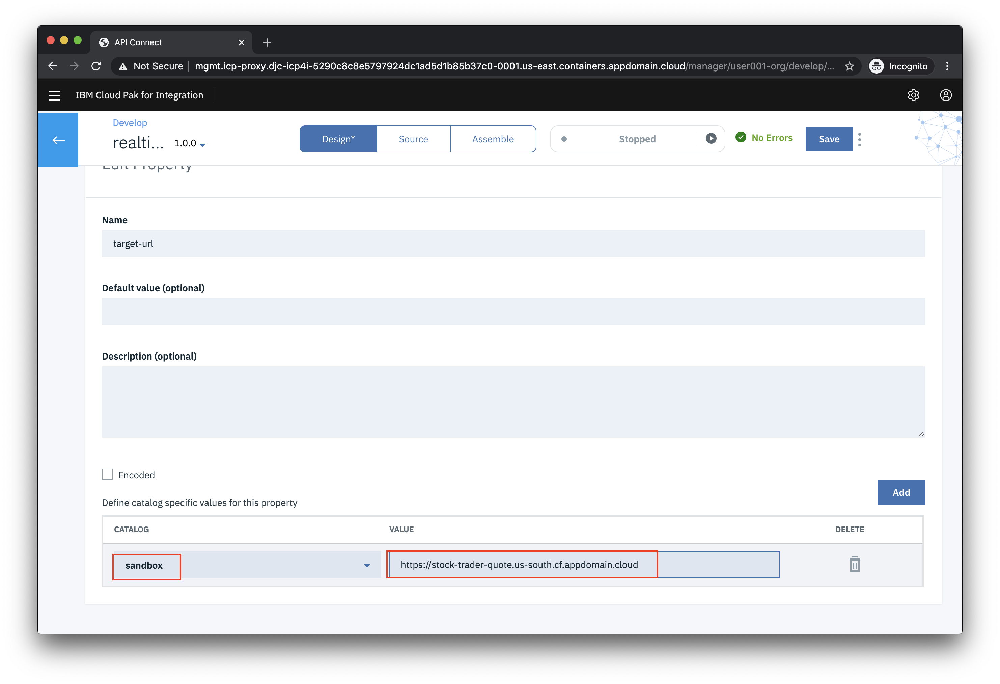

3.10 Click **Save** to complete the configuration.

## Step 4: Test the API

In the API designer, you have the ability to test the API immediately after creation in the **Assemble** view.

4.1 On the top Navigation, click **Assemble**.

  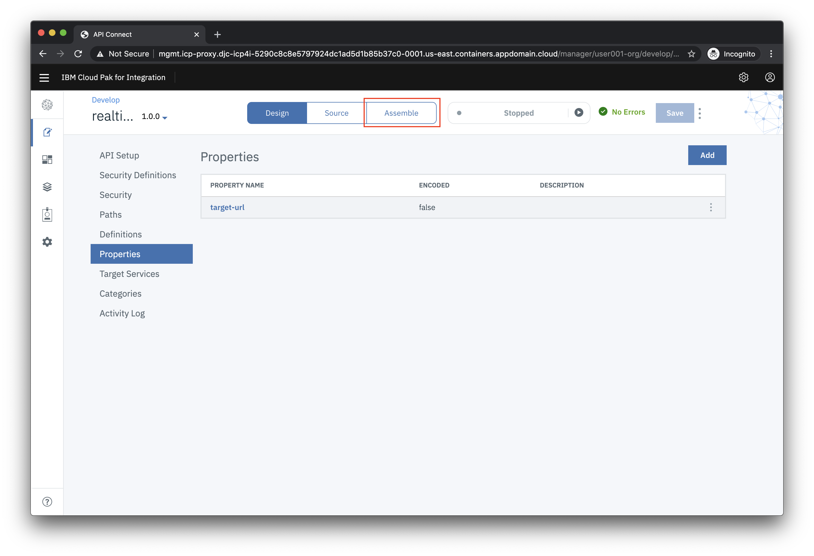

4.2 Click **proxy** in the flow designer. Note the window on the right with the configuration. It calls the **target-url** with the same request path sent to the API Connect endpoint.

  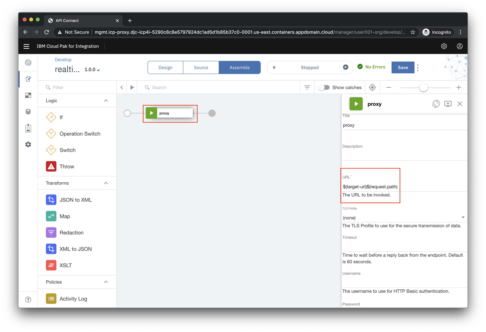   

4.3 Click the play icon as indicated in the image below.

  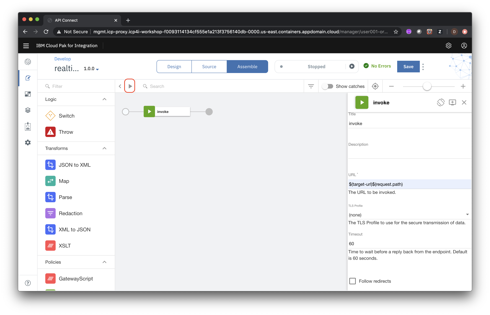

4.4 Click **Activate API** to publish the API to the gateway for testing.

  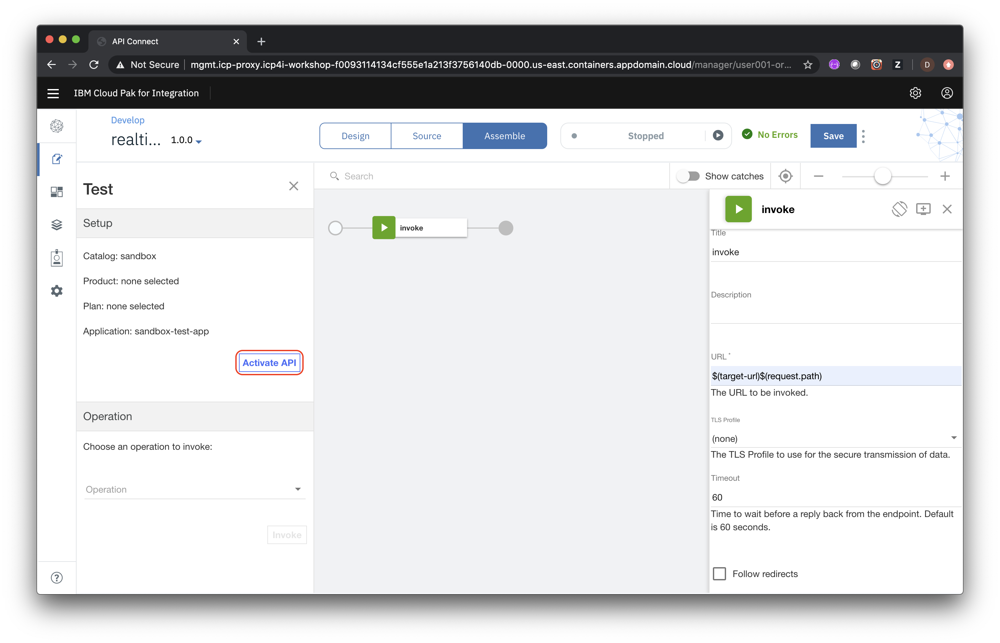

4.5 After the API is published, your screen should look like the image below.  

  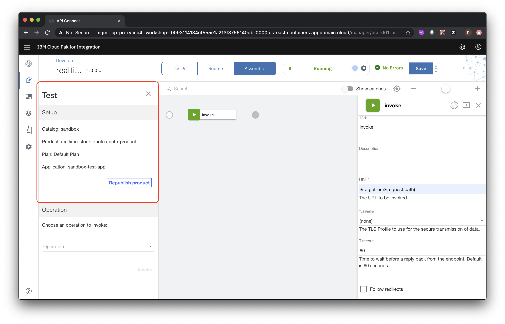

4.6 Under **Operation** choose get **/stock-quote/djia**.

4.7 Note that your **client-id** is prefilled for you.

4.8 Scroll all the way to the bottom of the browser window and click **Invoke**.

  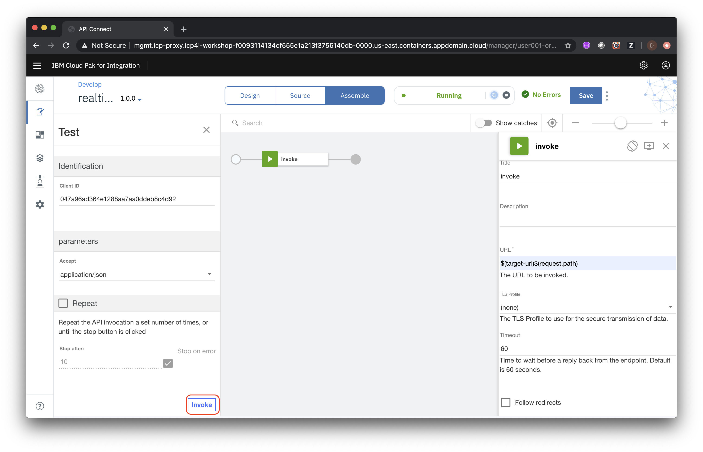

4.9 If this is the first test of the API, you may  see a certificate exception. Simply click on the URL and choose the option to proceed.

4.10 Go back to the test view and click **Invoke** again.

4.11 Now you should see a Response section with Status code 200 OK and the Body displaying the details of the Dow Industrial average.

  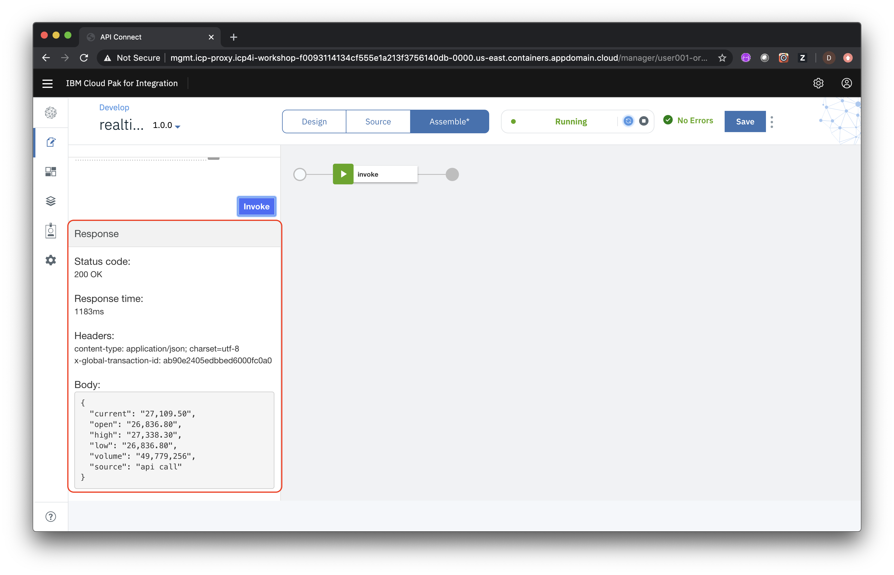

4.12 Scroll up in the test view until you see the **Client ID**. Copy the value to to a local text file so it can be used in the Stock Trader application later (**Note:** this is a shortcut to the regular process of publishing the API and then subscribing to it as a consumer).

  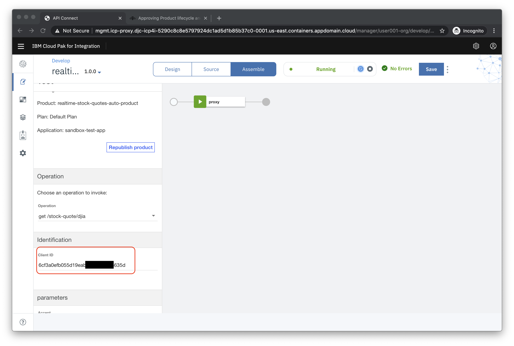

4.13 Next we'll get the endpoint for your API. Click on the **Home** icon (top left) and then click on the **Manage Catalogs** tile.

  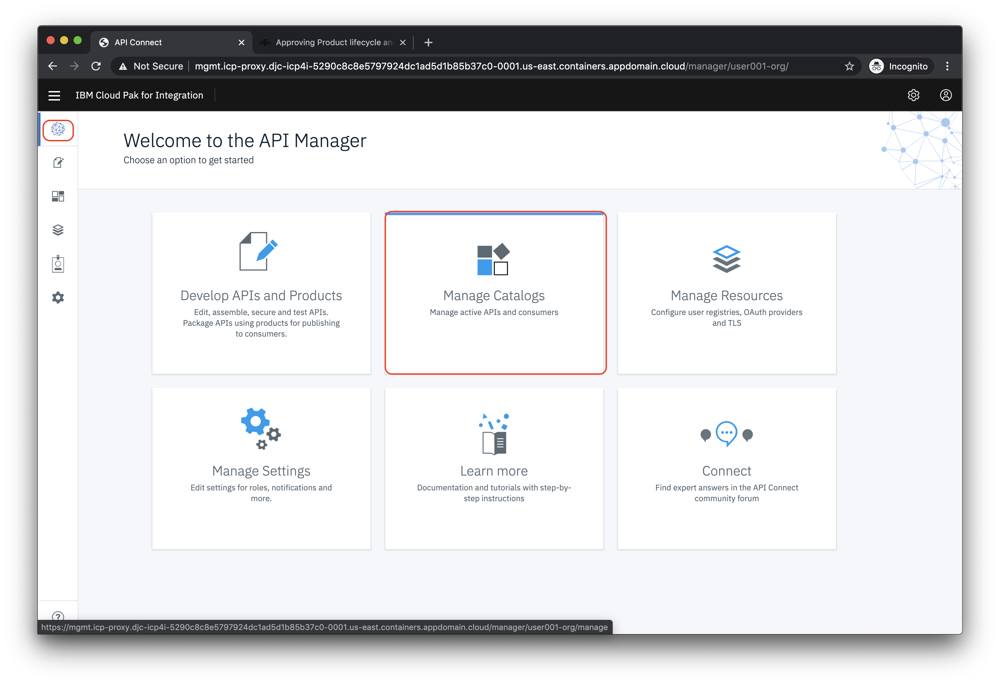

4.14 Click on the **Sandbox** tile.

4.15 Click on the **Settings** icon and then on **API Endpoints**. Copy the gateway URL and put it in the same file that you used for the **Client ID**

  

## Step 5: Create a new OpenShift project for the Stock Trader application

5.1 In the IBM Cloud Shell set an environment variable for the  *studentid* assigned to you by the instructors (e.g. **user001**)

```
export STUDENTID=user???
```

5.2 Create a new OpenShift project

```
oc new-project trader-$STUDENTID
```

## Step 6: Prepare for installation

6.1 From the  IBM Cloud Shell terminal

```
git clone https://github.com/IBMStockTraderLite/traderlite-cp4i.git
```

6.2 Go to the repo main directory required to run the setup scripts

```
cd traderlite-cp4i
```

6.3 Install the prerequisite subcharts (mongodb, mariadb, mq)

```
helm dependency update traderlite
```

6.4 Verify the output looks like the following:

```
$ helm dependency update traderlite
Hang tight while we grab the latest from your chart repositories...
...Successfully got an update from the "ibm" chart repository
...Successfully got an update from the "ibmstable" chart repository
...Successfully got an update from the "bitnami" chart repository
...Successfully got an update from the "stable" chart repository
Update Complete. ⎈Happy Helming!⎈
Saving 3 charts
Downloading mariadb from repo https://charts.bitnami.com/bitnami/
Downloading mongodb from repo https://charts.bitnami.com/bitnami/
Downloading ibm-mqadvanced-server-dev from repo https://raw.githubusercontent.com/IBM/charts/master/repo/stable/
Deleting outdated charts
```

## Step 7: Install the Trader Lite app

You'll install Trader Lite using a Helm chart.

7.1 Go to the repo  directory required to run the setup scripts

```
cd scripts
```

7.2 Run the following script, substituting your API Connect endpoint URL and API Key that you saved previously.

```
./initialInstall.sh [YOUR API CONNECT EXTERNAL URL] [YOUR API KEY]
```
7.3 Verify that the output looks like the following:

```
$  ./initialInstall.sh https://yoururl/ your_client_id
Script being run from correct folder
Validating student id  ...
Installing Trader Lite Helm chart ...
NAME: traderlite
LAST DEPLOYED: Mon Jun  1 11:34:46 2020
NAMESPACE: trader-user001
STATUS: deployed
REVISION: 1
NOTES:
Trader Lite V2.0 is deployed.

Run  the following command to get the URL of  the applications's UI:
 echo "http://"`oc get route traderlite-tradr  -o jsonpath='{.spec.host }'`"/tradr"
Trader Lite Helm chart install successful
Wait for all pods to be in the 'Ready' state before continuing
```

7.4 Wait for all the pods to start. Run the following command.  

```
oc get pods
```
Repeat the command  until all the pods are in the *Ready* state as shown below
```
$ oc get pods
NAME                                        READY   STATUS    RESTARTS   AGE
traderlite-mariadb-0                        1/1     Running   0          4m48s
traderlite-mongodb-6c79bf9554-kd5z8         1/1     Running   0          4m48s
traderlite-portfolio-5d774598fc-g4b2l       1/1     Running   0          4m48s
traderlite-stock-quote-7965448598-lzwqh     1/1     Running   0          4m48s
traderlite-trade-history-5648f749c4-5hbhq   1/1     Running   0          4m48s
traderlite-tradr-6cd8d879f4-hbcfr
```


## Step 8: Verify that the Trader Lite app is calling your API successfully

You will verify the configuration that you created that points at the API you created in API Connect.

8.1 From the command line run the following script:

```
./showTradrUrl.sh
```

8.2 Copy the URL that is output and access it with your browser

8.3 Log in using the username `stock` and the password `trader`

  

8.4 If the DJIA summary has data then you know that the API you created in API Connect is working !

  


## Summary

Congratulations ! You successfully completed the following key steps in this lab:

* Created an API by importing an OpenAPI definition for an existing REST service.
* Configured a  ClientID/API Key  for security set up a proxy to the existing API.
* Tested the API in the API Connect developer toolkit.
* Deployed the Trader Lite app and configured it to use the API you created.
* Tested the Trader Lite app to make sure it successfully uses your API.
